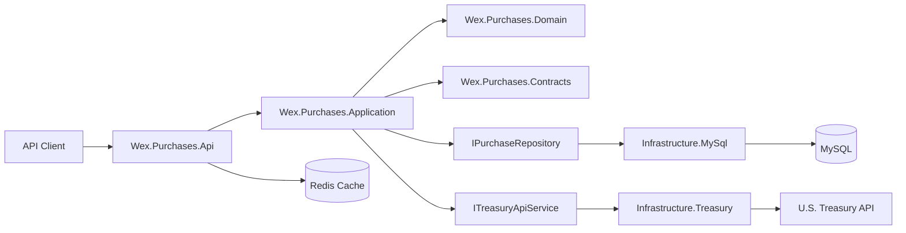
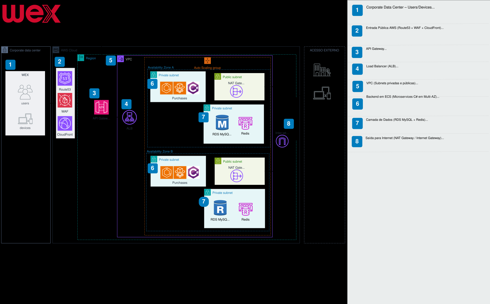
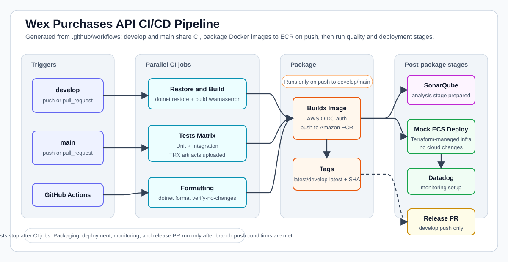
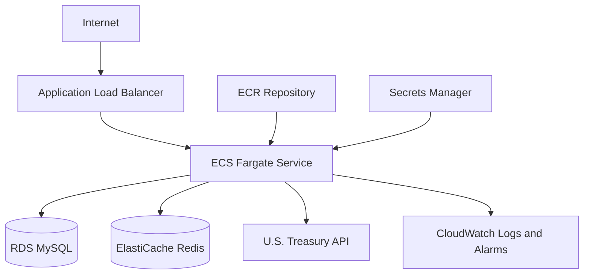
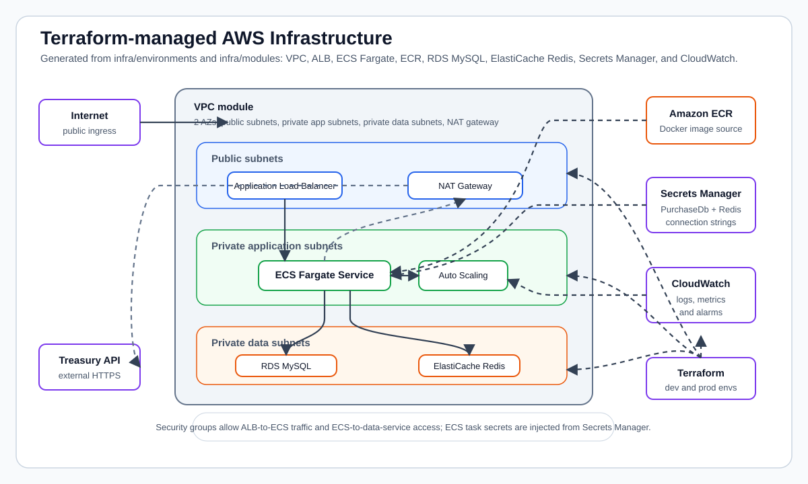

# Wex Purchases API

Production-grade .NET API for storing purchase transactions and retrieving their converted value using the United States Treasury Reporting Rates of Exchange API.

This repository was built for the Wex technical challenge and demonstrates Clean Architecture, automated tests, containerized local development, CI/CD with GitHub Actions, and AWS infrastructure provisioned with Terraform.

## Contents

- [Overview](#overview)
- [Features](#features)
- [Technology Stack](#technology-stack)
- [Architecture](#architecture)
- [Local Setup](#local-setup)
- [Running With Docker Compose](#running-with-docker-compose)
- [Local Code Quality With SonarQube](#local-code-quality-with-sonarqube)
- [Running Tests](#running-tests)
- [API Reference](#api-reference)
- [CI/CD](#cicd)
- [AWS Deployment](#aws-deployment)
- [Project Structure](#project-structure)
- [Documentation](#documentation)

## Overview

The API supports two core business capabilities:

1. Create a purchase transaction in USD.
2. Retrieve a purchase transaction converted into a supported country currency.

Currency conversion follows the Wex challenge product brief:

- Exchange rates are retrieved from the Treasury Reporting Rates of Exchange API.
- The selected rate must have a `record_date` less than or equal to the purchase date.
- The selected rate must be within the six-month window before the purchase date.
- If no valid exchange rate exists, the API returns an error.
- Monetary values are rounded to two decimal places.
- The repository must run locally without manually installing databases.

## Features

| Capability | Description |
| --- | --- |
| Purchase storage | Persists purchase description, transaction date, and USD amount in MySQL. |
| Currency conversion | Converts stored purchases using Treasury exchange rates. |
| Supported country catalog | Supports Brazil, Canada, and Mexico through explicit country-code mapping. |
| Validation | Validates descriptions, transaction dates, positive amounts, decimal precision, purchase IDs, and country codes. |
| Resilient Treasury calls | Uses `HttpClientFactory` and Polly retry/timeout policies for external API stability. |
| Redis cache | Caches converted purchase lookups for short-lived repeated reads. |
| Docker Compose | Runs API, MySQL, and Redis together with no manual database installation. |
| Automated tests | Includes unit and integration tests using xUnit, Moq, and WebApplicationFactory. |
| CI/CD | Builds, tests, validates formatting, packages Docker images, pushes to ECR, and deploys to ECS. |
| Infrastructure as Code | Provisions AWS VPC, ALB, ECS Fargate, ECR, RDS MySQL, ElastiCache Redis, Secrets Manager, IAM, and CloudWatch resources with Terraform. |

## Technology Stack

| Area | Technologies |
| --- | --- |
| Runtime | .NET 10, ASP.NET Core |
| Architecture | Clean Architecture, dependency inversion, repository pattern, decorator pattern |
| Persistence | Entity Framework Core, MySQL, Pomelo MySQL provider |
| Query/data access strategy | EF Core for transactional persistence; Dapper is documented as the intended read-optimization option for future high-volume query paths |
| Cache | Redis, `IDistributedCache`, StackExchange.Redis |
| External integration | Treasury Fiscal Data API, `HttpClientFactory`, Polly |
| Local platform | Docker, Docker Compose |
| Testing | xUnit, Moq, Moq.AutoMock, WebApplicationFactory, EF Core InMemory provider |
| CI/CD | GitHub Actions, Docker Buildx, Amazon ECR, Amazon ECS |
| Infrastructure | Terraform, AWS ECS Fargate, ALB, VPC, RDS MySQL, ElastiCache Redis, CloudWatch, IAM OIDC |

## Architecture

The project follows Clean Architecture. Business rules live in the Domain and Application layers, while infrastructure concerns such as MySQL, Redis, HTTP integrations, Docker, and AWS are kept outside the core.





Key design points:

- Controllers are thin and delegate use cases to application services.
- The Application layer owns validation, orchestration, caching decoration, and conversion workflow.
- The Domain layer owns entities and value objects such as `PurchaseTransaction` and `Money`.
- EF Core is used for transactional persistence and migrations.
- Redis is used to reduce repeated external conversion lookups.
- Treasury integration is isolated behind a service contract and resilience policies.

See [Clean Architecture](docs/architecture/clean-architecture.md), [AWS Architecture](docs/architecture/aws-architecture.md), and [Decisions and Tradeoffs](docs/architecture/decisions-and-tradeoffs.md).

## Local Setup

Prerequisites:

- .NET 10 SDK
- Docker Desktop or compatible Docker engine
- Git

Restore and build:

```bash
dotnet restore src/Wex.Purchases.slnx
dotnet build src/Wex.Purchases.slnx
```

Run the API directly:

```bash
dotnet run --project src/Wex.Purchases.Api/Wex.Purchases.Api.csproj
```

When running directly, MySQL and Redis must be available using the configured connection strings. For most local development, use Docker Compose instead.

Detailed guide: [Local Development](docs/setup/local-development.md).

## Running With Docker Compose

Docker Compose starts the API, MySQL, Redis, and the local SonarQube stack:

```bash
docker compose up --build
```

Default service URLs:

| Service | URL |
| --- | --- |
| API | `http://localhost:8080` |
| Health check | `http://localhost:8080/health` |
| Swagger UI | `http://localhost:8080/swagger` |
| MySQL | `localhost:3306` |
| Redis | `localhost:6379` |
| SonarQube | `http://localhost:9000` |

The API applies EF Core migrations automatically during startup when not running in the `Testing` environment.

Detailed guide: [Docker Compose](docs/setup/docker-compose.md).

## Local Code Quality With SonarQube

The Docker Compose file includes a local SonarQube Community Edition service and a dedicated PostgreSQL database used only by SonarQube.

Start only SonarQube and its PostgreSQL database:

```bash
docker compose up -d sonarqube sonarqube-db
```

Or start the full local environment, including the API, MySQL, Redis, SonarQube, and PostgreSQL:

```bash
docker compose up --build
```

Open SonarQube:

```text
http://localhost:9000
```

Default login:

```text
admin / admin
```

On the first login, SonarQube may ask you to change the default password.

Create the first local project:

1. Sign in to SonarQube.
2. Choose to create a local project manually.
3. Use `wex-purchases-api` as the project key.
4. Generate a token for local analysis.
5. Replace `<TOKEN>` in the commands below with the generated token.

Run the .NET analysis locally:

```bash
docker compose up -d sonarqube sonarqube-db
dotnet tool install --global dotnet-sonarscanner

dotnet sonarscanner begin /k:"wex-purchases-api" /d:sonar.host.url="http://localhost:9000" /d:sonar.token="<TOKEN>"

dotnet build

dotnet sonarscanner end /d:sonar.token="<TOKEN>"
```

If running from the repository root and `dotnet build` does not infer the solution, build the solution explicitly:

```bash
dotnet build src/Wex.Purchases.slnx
```

This setup is local-only. It does not configure GitHub Actions or SonarCloud integration.

Detailed guide: [SonarQube](docs/ci-cd/sonarqube.md).

## Running Tests

Run all tests:

```bash
dotnet test tests/Wex.Purchases.UnitTests/Wex.Purchases.UnitTests.csproj
dotnet test tests/Wex.Purchases.IntegrationTests/Wex.Purchases.IntegrationTests.csproj
```

The integration test suite uses `WebApplicationFactory`, EF Core InMemory database replacement, and fake Treasury services/handlers so the tests do not depend on manually installed databases or live external API availability.

Detailed guide: [Testing Strategy](docs/testing/testing-strategy.md).

## API Reference

Base route:

```text
/api/purchases
```

### Create Purchase

```http
POST /api/purchases
Content-Type: application/json
```

Request:

```json
{
  "description": "Office supplies",
  "transactionDate": "2026-05-10T00:00:00Z",
  "purchaseAmount": 125.50
}
```

Response:

```json
{
  "id": "5f4b4085-a650-47ca-a7b4-6b89df4e479a",
  "description": "Office supplies",
  "transactionDate": "2026-05-10T00:00:00Z",
  "purchaseAmount": 125.50
}
```

Validation rules:

- `description` is required and must be at most 50 characters.
- `transactionDate` is required.
- `purchaseAmount` must be positive.
- `purchaseAmount` must have at most two decimal places.

### Get Converted Purchase

```http
GET /api/purchases/{id}?countryCode=BR
```

Response:

```json
{
  "id": "5f4b4085-a650-47ca-a7b4-6b89df4e479a",
  "description": "Office supplies",
  "transactionDate": "2026-05-10T00:00:00Z",
  "purchaseAmount": 125.50,
  "country": "Brazil",
  "currency": "Real",
  "countryCurrencyDescription": "Brazil-Real",
  "exchangeRate": 5.15,
  "recordDate": "2026-03-31",
  "convertedAmount": 646.33,
  "from": "api"
}
```

Supported `countryCode` values:

| Code | Country | Treasury currency description |
| --- | --- | --- |
| `BR` | Brazil | `Brazil-Real` |
| `CA` | Canada | `Canada-Dollar` |
| `MX` | Mexico | `Mexico-Peso` |

See [Business Rules](docs/business/business-rules.md) and [Treasury Integration](docs/business/treasury-integration.md).

## CI/CD

The repository contains separate workflows for `develop` and `main`.

| Workflow | Trigger | Purpose |
| --- | --- | --- |
| `ci-develop.yml` | Push and pull request to `develop` | Build, test, format-check, publish development image, deploy to ECS development. |
| `ci-main.yml` | Push to `main` | Build, test with coverage, enforce coverage gate, format-check, publish production image, deploy to ECS production with health-check rollback. |

The workflows use GitHub OIDC to assume AWS IAM roles without storing long-lived AWS access keys in GitHub.



See [GitHub Actions](docs/ci-cd/github-actions.md), [Deployment Flow](docs/ci-cd/deployment-flow.md), and [Terraform Pipeline](docs/ci-cd/terraform-pipeline.md).

## AWS Deployment

The target deployment platform is AWS ECS Fargate behind an Application Load Balancer. The API runs in private application subnets, while MySQL and Redis run in private data subnets. Public ingress is handled by the ALB.





See [Terraform](docs/infra/terraform.md), [ECS Fargate](docs/infra/ecs-fargate.md), [Networking](docs/infra/networking.md), and [Observability](docs/infra/observability.md).

## Project Structure

```text
.
├── .github/workflows
│   ├── ci-develop.yml
│   └── ci-main.yml
├── docs
│   ├── architecture
│   ├── business
│   ├── ci-cd
│   ├── infra
│   ├── setup
│   └── testing
├── infra
│   ├── environments
│   │   ├── dev
│   │   └── prod
│   └── modules
│       ├── alb
│       ├── ecr
│       ├── ecs
│       ├── elasticache-redis
│       ├── rds-mysql
│       └── vpc
├── src
│   ├── Wex.Purchases.Api
│   ├── Wex.Purchases.Application
│   ├── Wex.Purchases.Contracts
│   ├── Wex.Purchases.Domain
│   ├── Wex.Purchases.Infrastructure.MySql
│   └── Wex.Purchases.Infrastructure.Treasury
└── tests
    ├── Wex.Purchases.IntegrationTests
    └── Wex.Purchases.UnitTests
```

## Documentation

### Setup

- [Local Development](docs/setup/local-development.md)
- [Environment Variables](docs/setup/environment-variables.md)
- [Docker Compose](docs/setup/docker-compose.md)

### Architecture

- [Clean Architecture](docs/architecture/clean-architecture.md)
- [AWS Architecture](docs/architecture/aws-architecture.md)
- [Application Flow](docs/architecture/application-flow.md)
- [Decisions and Tradeoffs](docs/architecture/decisions-and-tradeoffs.md)

### CI/CD

- [GitHub Actions](docs/ci-cd/github-actions.md)
- [SonarQube](docs/ci-cd/sonarqube.md)
- [Terraform Pipeline](docs/ci-cd/terraform-pipeline.md)
- [Deployment Flow](docs/ci-cd/deployment-flow.md)
- [Environments](docs/ci-cd/environments.md)

### Business

- [Business Rules](docs/business/business-rules.md)
- [Functional Requirements](docs/business/functional-requirements.md)
- [Non-Functional Requirements](docs/business/non-functional-requirements.md)
- [Treasury Integration](docs/business/treasury-integration.md)

### Testing

- [Testing Strategy](docs/testing/testing-strategy.md)
- [Unit Tests](docs/testing/unit-tests.md)
- [Integration Tests](docs/testing/integration-tests.md)

### Infrastructure

- [Terraform](docs/infra/terraform.md)
- [ECS Fargate](docs/infra/ecs-fargate.md)
- [Networking](docs/infra/networking.md)
- [Observability](docs/infra/observability.md)
