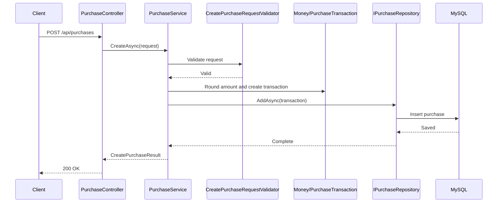
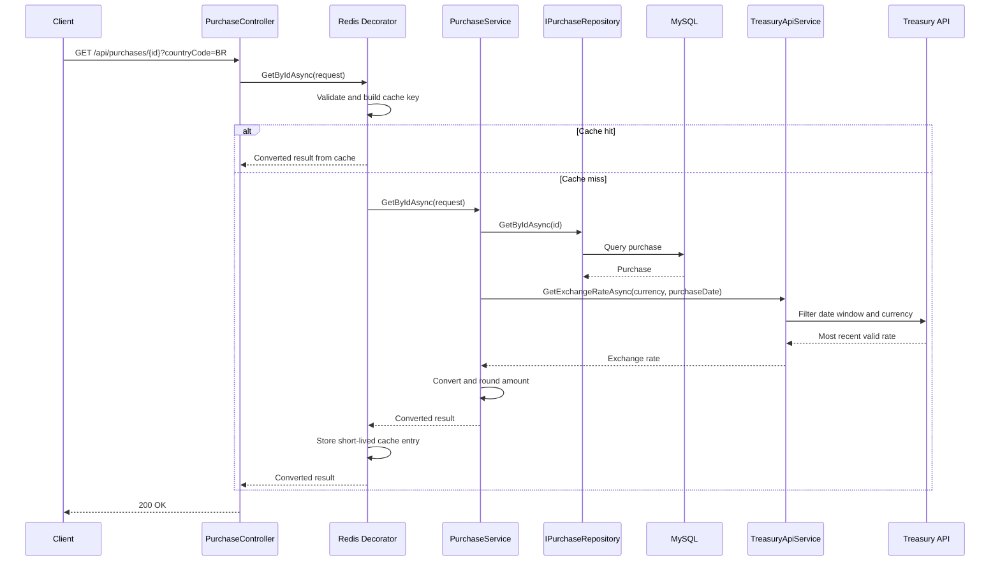

# Application Flow

This document describes the runtime flow for creating purchases and retrieving converted purchases.

## Create Purchase Flow



## Currency Conversion Flow



## Treasury Rate Selection

The Treasury request filters rates by:

- `country_currency_desc:eq:{currencyDescription}`
- `record_date:lte:{purchaseDate}`
- `record_date:gte:{purchaseDate minus 6 months}`

The query sorts by descending `record_date` and requests one item:

```text
sort=-record_date
page[size]=1
```

This returns the most recent rate less than or equal to the purchase date within the allowed six-month window.

## Error Flow

| Scenario | Behavior |
| --- | --- |
| Invalid create request | Validation exception handled by global exception middleware. |
| Invalid country code | Validation exception with accepted values. |
| Purchase not found | Service returns `null`; API returns the serialized result from the controller contract. |
| No Treasury rate found | Application throws an error explaining no exchange rate was found. |
| Treasury transient failure | Polly retries transient failures and timeout failures. |
| Treasury permanent failure | HTTP exception is surfaced through global exception handling. |

## Related Documentation

- [Business Rules](../business/business-rules.md)
- [Treasury Integration](../business/treasury-integration.md)
- [Clean Architecture](clean-architecture.md)
