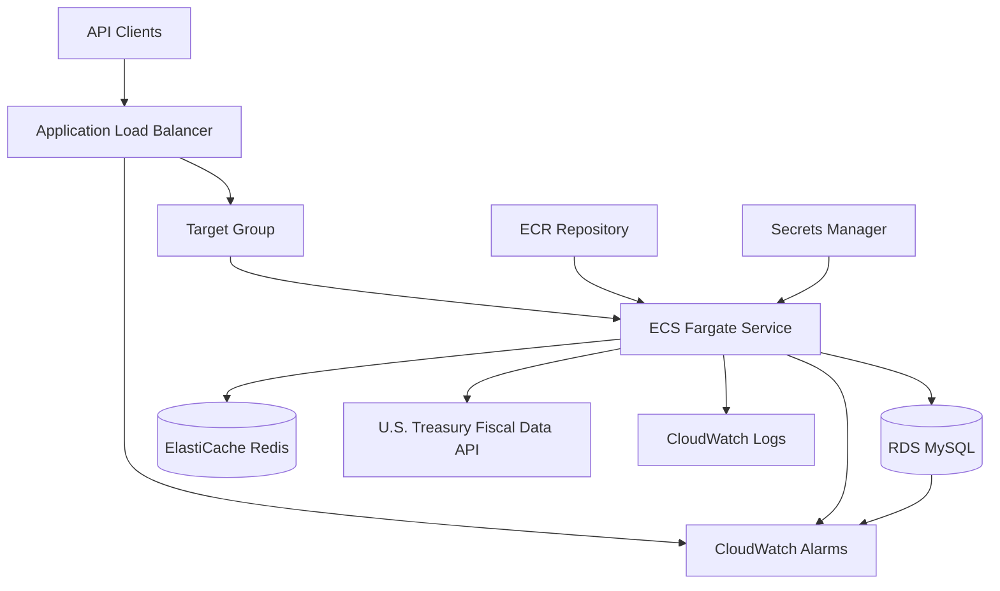

# AWS Architecture

The production architecture runs the Wex Purchases API on AWS ECS Fargate behind an Application Load Balancer. Stateful dependencies are managed services in private subnets.

## High-Level Diagram

## Resource Responsibilities

| Resource | Responsibility |
| --- | --- |
| VPC | Network boundary for the platform. |
| Public subnets | Host the Application Load Balancer. |
| Private application subnets | Host ECS Fargate tasks. |
| Private data subnets | Host RDS MySQL and ElastiCache Redis. |
| ALB | Public HTTP or HTTPS entry point and health-check integration. |
| ECS Fargate | Runs the API container without EC2 host management. |
| ECR | Stores versioned Docker images. |
| RDS MySQL | Stores purchase transactions. |
| ElastiCache Redis | Stores short-lived converted purchase cache entries. |
| Secrets Manager | Stores connection strings consumed by ECS tasks. |
| CloudWatch | Stores logs and alarms for runtime visibility. |
| IAM | Grants task execution, task runtime, and deployment permissions. |

## Network Flow

1. Clients call the ALB.
2. The ALB forwards healthy requests to ECS tasks on port `8080`.
3. ECS tasks read secrets from Secrets Manager.
4. ECS tasks connect privately to RDS and Redis.
5. ECS tasks call the public Treasury API for exchange rates.
6. Logs are written to CloudWatch.

## Environment Differences

| Setting | Development | Production |
| --- | --- | --- |
| NAT Gateway | Single NAT gateway | NAT gateway per availability design from module input |
| ALB deletion protection | Disabled | Enabled |
| RDS Multi-AZ | Disabled | Enabled |
| RDS backups | 7 days | 14 days |
| RDS deletion protection | Disabled | Enabled |
| Redis snapshots | 1 day | 7 days |
| ECS log retention | 30 days | 90 days |
| Autoscaling targets | CPU 70%, memory 75% | CPU 65%, memory 70% |

## Security Model

- ALB is the only public application entry point.
- ECS tasks run in private application subnets.
- RDS and Redis run in private data subnets.
- RDS and Redis accept traffic only from the ECS service security group.
- Runtime secrets are stored in Secrets Manager.
- GitHub Actions authenticates to AWS with OIDC and short-lived credentials.

## Related Documentation

- [Terraform](../infra/terraform.md)
- [ECS Fargate](../infra/ecs-fargate.md)
- [Networking](../infra/networking.md)
- [Observability](../infra/observability.md)
