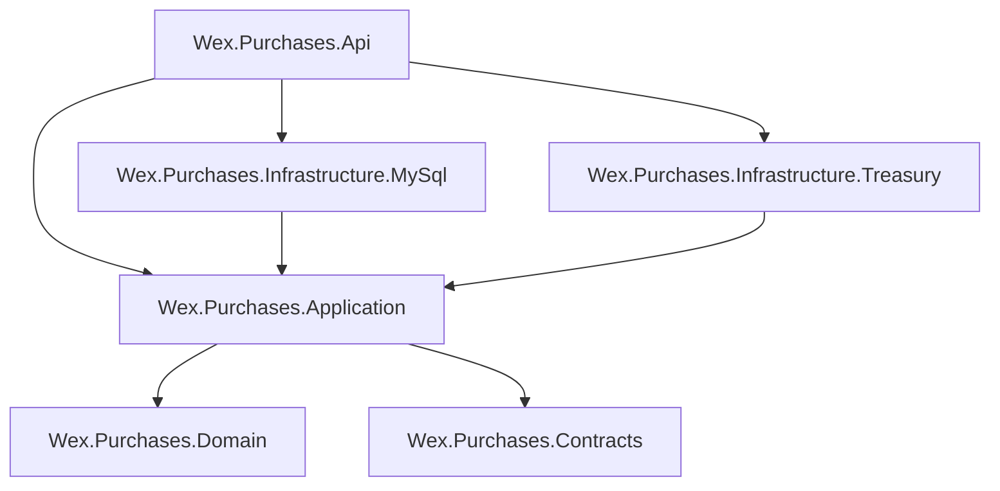

# Clean Architecture

The Wex Purchases API is organized around Clean Architecture to keep business rules independent from delivery mechanisms, databases, cloud infrastructure, and external APIs.

## Architectural Goal

The primary goal is to protect the core purchase and currency-conversion rules from infrastructure changes.

The system must be able to change MySQL providers, introduce optimized read paths, replace Redis, adjust AWS deployment topology, or mock the Treasury API in tests without rewriting the business use cases.

## Layer Overview



| Layer | Project | Responsibility |
| --- | --- | --- |
| API | `Wex.Purchases.Api` | HTTP controllers, middleware, Swagger, health checks, dependency injection composition, exception handling. |
| Application | `Wex.Purchases.Application` | Use cases, request validation, purchase orchestration, conversion orchestration, caching decorator, repository and integration contracts. |
| Domain | `Wex.Purchases.Domain` | Business entities, value objects, domain invariants, monetary rounding behavior. |
| Contracts | `Wex.Purchases.Contracts` | API request and response contracts shared at the boundary. |
| Infrastructure.MySql | `Wex.Purchases.Infrastructure.MySql` | EF Core DbContext, migrations, entity configuration, repository implementation. |
| Infrastructure.Treasury | `Wex.Purchases.Infrastructure.Treasury` | Treasury API client, request mapping, response mapping, HttpClient and Polly policies. |

## Dependency Rule

Dependencies point inward:

- API depends on Application and Infrastructure only to compose the runtime.
- Application depends on Domain and Contracts.
- Domain depends on no application or infrastructure project.
- Infrastructure depends on Application abstractions and Domain models.

This keeps the most important policies in the center and the most volatile details at the edges.

## API Layer

The API layer exposes HTTP resources and delegates business work to `IPurchaseService`.

Current endpoints:

| Method | Route | Purpose |
| --- | --- | --- |
| `POST` | `/api/purchases` | Creates a purchase transaction. |
| `GET` | `/api/purchases/{id}?countryCode={code}` | Retrieves a purchase converted to the requested country currency. |
| `GET` | `/health` | Provides container and load balancer health checks. |

The controller does not contain business rules. It builds input models, calls the application service, and returns the result.

## Application Layer

The Application layer implements the use cases:

- Validate purchase creation requests.
- Normalize purchase amounts through the `Money` value object.
- Persist purchase transactions through `IPurchaseRepository`.
- Validate converted-purchase lookup requests.
- Resolve supported country codes.
- Retrieve the latest valid Treasury exchange rate.
- Convert and round the purchase amount.
- Cache converted lookup responses through `PurchaseServiceCachingDecorator`.

Important application types:

| Type | Responsibility |
| --- | --- |
| `PurchaseService` | Core create and converted-retrieval workflow. |
| `IPurchaseService` | Use-case boundary consumed by the API. |
| `IPurchaseRepository` | Persistence abstraction. |
| `CreatePurchaseRequestValidator` | Creation validation rules. |
| `GetPurchaseConvertedRequestValidator` | Lookup validation rules. |
| `SupportedCurrencyCatalog` | Supported country-code mapping. |
| `PurchaseServiceCachingDecorator` | Redis-backed cache wrapper for converted reads. |

## Domain Layer

The Domain layer contains the concepts that should remain stable even if technical details change.

| Type | Responsibility |
| --- | --- |
| `PurchaseTransaction` | Represents a stored USD purchase transaction. |
| `Money` | Normalizes monetary values to two decimal places using `MidpointRounding.AwayFromZero`. |
| `Entity` | Base entity behavior. |
| `IAggregateRoot` | Marker for aggregate roots. |

The `Money` value object centralizes rounding so the API does not scatter currency precision decisions across controllers, repositories, or integrations.

## Infrastructure Layer

Infrastructure is split by external concern.

### MySQL Infrastructure

`Wex.Purchases.Infrastructure.MySql` contains:

- `PurchaseDbContext`
- EF Core entity configuration
- migrations
- `PurchaseRepository`
- dependency injection registration

EF Core is used because the project needs reliable transactional writes, migrations, model mapping, and strong integration with ASP.NET Core dependency injection.

### Treasury Infrastructure

`Wex.Purchases.Infrastructure.Treasury` contains:

- typed Treasury API client
- options binding
- Fiscal Data API query construction
- response deserialization
- retry and timeout policies with Polly

The Treasury implementation is isolated so tests can replace it with fakes and the application service can focus on business orchestration.

## EF Core and Dapper Strategy

The current implementation uses EF Core for purchase persistence. EF Core is appropriate for:

- schema migrations
- transactional writes
- aggregate persistence
- LINQ-based queries
- change tracking where needed

Dapper is included in the documented technology direction as the preferred option for future read-heavy or reporting-style query paths where direct SQL and minimal object mapping would be beneficial. The tradeoff is deliberate:

| Tool | Best Fit | Tradeoff |
| --- | --- | --- |
| EF Core | Transactional persistence and migrations | More abstraction and overhead than direct SQL. |
| Dapper | High-performance read models and tuned SQL | More manual SQL and mapping responsibility. |

In this codebase, the repository currently has simple write and lookup operations, so EF Core is sufficient. Dapper should be introduced only when a real read-optimization requirement appears.

## Redis Cache

Redis is used through `IDistributedCache` and a decorator around `IPurchaseService`.

The cache stores converted purchase lookups using this key pattern:

```text
purchases:get-by-id:{purchaseId}:{countryCode}
```

The current expiration is intentionally short-lived. It reduces repeated reads and Treasury calls during bursts while limiting stale converted data risk.

## Why Docker Compose

Docker Compose is used because the challenge requires the repository to run without manually installing databases.

Compose provides:

- API container
- MySQL 8.4 container
- Redis container
- deterministic local ports
- health-check sequencing for MySQL
- persistent MySQL volume for local development

## Why ECS Fargate

ECS Fargate was selected because it provides a production container runtime without requiring EC2 host management.

Benefits:

- no server patching
- native integration with ALB, ECR, IAM, Secrets Manager, and CloudWatch
- simple scaling model
- private subnet deployment
- task-level CPU and memory sizing

The tradeoff is less low-level host control than EC2-backed ECS or Kubernetes, which is acceptable for this API.

## Why GitHub Actions

GitHub Actions keeps CI/CD close to the repository and supports:

- branch-based workflows
- matrix test execution
- artifact upload
- Docker Buildx cache
- AWS OIDC federation
- environment protection rules

This is a pragmatic fit for a technical challenge repository and scales naturally into a production workflow.

## Why Terraform

Terraform is used to make infrastructure repeatable, reviewable, and environment-specific.

The repository separates:

- reusable modules under `infra/modules`
- environment compositions under `infra/environments/dev` and `infra/environments/prod`

This design allows development and production to share the same architecture while tuning durability, scaling, retention, and deletion protection per environment.

## Why OIDC Authentication

GitHub Actions uses AWS IAM OIDC role assumption instead of long-lived AWS access keys.

Benefits:

- no static cloud credentials stored in GitHub
- short-lived AWS credentials per workflow run
- least-privilege roles per environment
- auditable AWS STS sessions
- cleaner credential rotation story

## Related Documentation

- [Application Flow](application-flow.md)
- [Decisions and Tradeoffs](decisions-and-tradeoffs.md)
- [AWS Architecture](aws-architecture.md)
- [Testing Strategy](../testing/testing-strategy.md)
