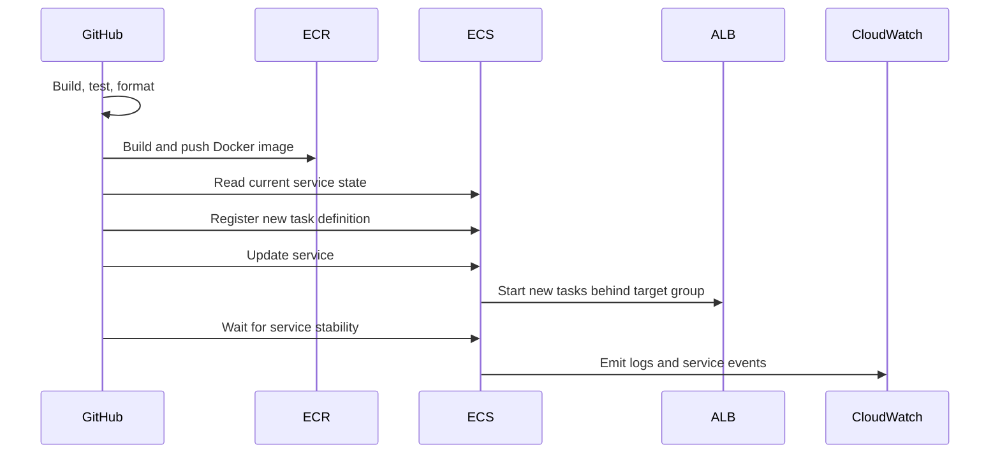

# Deployment Flow

Deployments are performed by GitHub Actions after the code has passed build, test, and formatting gates.

## Application Deployment Sequence

## Development Deployment

Development deploys occur on pushes to `develop`.

Characteristics:

- image tag: `develop-{sha}`
- moving tag: `develop-latest`
- environment: `development`
- waits for ECS service stability
- uploads deployment artifacts

## Production Deployment

Production deploys occur on pushes to `main`.

Characteristics:

- image tag: `prod-{sha}`
- moving tag: `latest`
- environment: `production`
- waits for ECS service stability
- runs a post-deploy health check
- rolls back to the previous task definition if the health check fails

## Rollback Behavior

The production workflow captures the current task definition before deployment. If the post-deploy health check fails, the workflow updates the ECS service back to that previous task definition and waits for stability.

Rollback protects production from a deployment that is technically stable at the ECS level but unhealthy at the application level.

## Deployment Artifacts

Artifacts include:

- service state before deployment
- source task definition
- rendered task definition
- service state after deployment

These artifacts help compare exactly what changed during a deployment.

## Related Documentation

- [GitHub Actions](github-actions.md)
- [Environments](environments.md)
- [Observability](../infra/observability.md)
