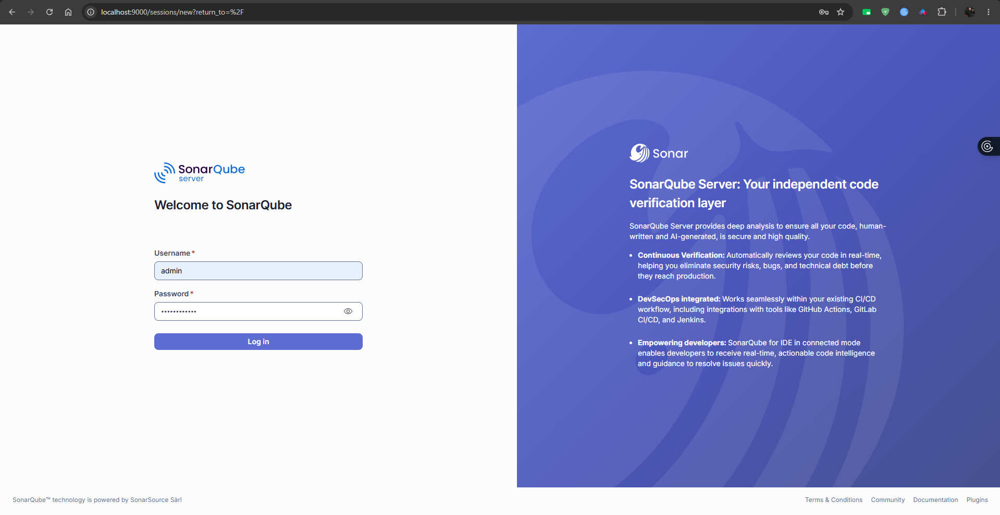
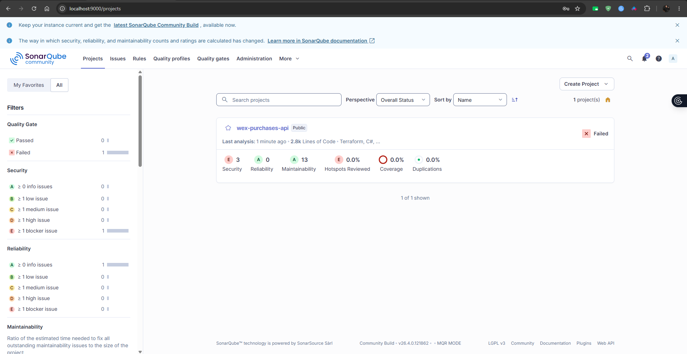
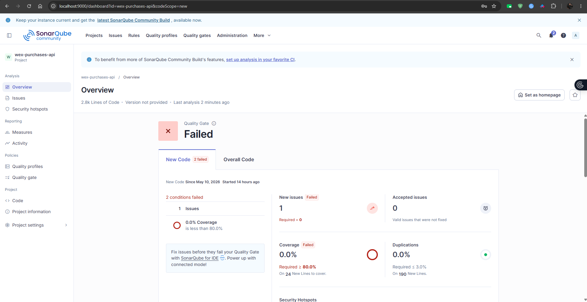

# SonarQube - Local Code Quality

Este projeto inclui uma instancia local do SonarQube Community Edition no Docker Compose para validar qualidade de codigo, issues, security hotspots, duplicacao e cobertura antes de promover alteracoes.

O SonarQube local usa um banco PostgreSQL dedicado, tambem definido no `docker-compose.yml`, e fica disponivel em:

```text
http://localhost:9000
```

## Como subir o SonarQube

Para subir apenas o SonarQube e o banco PostgreSQL usado por ele:

```bash
docker compose up -d sonarqube sonarqube-db
```

Para subir todo o ambiente local, incluindo API, MySQL, Redis, SonarQube, PostgreSQL e Datadog:

```bash
docker compose up -d --build
```

Valide se os containers estao em execucao:

```bash
docker compose ps sonarqube sonarqube-db
```

## Primeiro acesso

Acesse `http://localhost:9000` no navegador.

Login padrao local:

```text
admin / admin
```

No primeiro login, o SonarQube pode solicitar a troca da senha padrao.



## Criacao do projeto local

Depois do login:

1. Crie um projeto local manualmente.
2. Use `wex-purchases-api` como nome e chave do projeto.
3. Gere um token para analise local.
4. Guarde o token apenas em ambiente local ou em um gerenciador de secrets.

## Como executar a analise

Instale o scanner .NET, caso ainda nao exista no ambiente:

```bash
dotnet tool install --global dotnet-sonarscanner
```

Execute a analise a partir da raiz do repositorio:

```bash
dotnet sonarscanner begin /k:"wex-purchases-api" /d:sonar.host.url="http://localhost:9000" /d:sonar.token="<TOKEN>"
dotnet build src/Wex.Purchases.slnx
dotnet sonarscanner end /d:sonar.token="<TOKEN>"
```

Substitua `<TOKEN>` pelo token gerado no SonarQube.

## Onde visualizar os resultados

Na pagina **Projects**, o SonarQube mostra a lista de projetos analisados, status do Quality Gate e indicadores principais de seguranca, confiabilidade, manutenibilidade, cobertura e duplicacao.



Ao abrir o projeto `wex-purchases-api`, a aba **Overview** exibe o resultado detalhado do Quality Gate. No exemplo abaixo, o gate esta falhando porque ha issue em codigo novo e cobertura abaixo do limite configurado.



## Como interpretar o Quality Gate

O Quality Gate consolida regras minimas de qualidade para permitir ou bloquear uma entrega. Os principais indicadores acompanhados neste projeto sao:

- **Issues**: problemas detectados por regras de qualidade, seguranca ou confiabilidade.
- **Coverage**: percentual de codigo coberto por testes.
- **Duplications**: percentual de codigo duplicado.
- **Security Hotspots**: pontos que precisam de revisao manual de seguranca.
- **Maintainability**: impacto estimado de problemas que aumentam debito tecnico.

Se o Quality Gate falhar, revise as condicoes marcadas como `Failed`, corrija o codigo ou ajuste a cobertura, e execute a analise novamente.

## Debug de problemas

Se o SonarQube nao abrir:

- Confirme se os containers estao ativos com `docker compose ps sonarqube sonarqube-db`.
- Verifique os logs com `docker compose logs sonarqube`.
- Aguarde a inicializacao completa; o SonarQube pode levar alguns minutos na primeira execucao.

Se a analise falhar:

- Confirme se o token esta correto.
- Confirme se `http://localhost:9000` esta acessivel no navegador.
- Execute o build separadamente com `dotnet build src/Wex.Purchases.slnx`.
- Verifique se o projeto foi criado com a mesma chave usada em `/k:"wex-purchases-api"`.

## Observacoes

Esta configuracao e local. Ela nao substitui uma integracao hospedada com SonarCloud ou uma instancia SonarQube compartilhada em pipelines de CI/CD.
