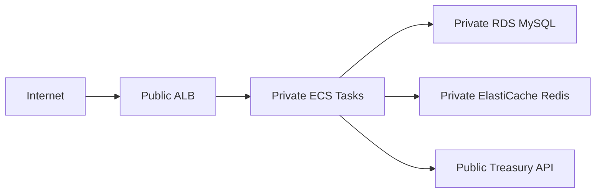

# Networking

The AWS network is designed to expose only the load balancer publicly while keeping application and data workloads private.

## Subnet Model

| Subnet Type | Resources |
| --- | --- |
| Public subnets | Application Load Balancer, internet-facing routing. |
| Private application subnets | ECS Fargate tasks. |
| Private data subnets | RDS MySQL and ElastiCache Redis. |

## Traffic Flow

## Security Groups

| Security Group | Inbound | Outbound |
| --- | --- | --- |
| ALB | Allowed ingress CIDRs on listener ports | ECS service port |
| ECS service | ALB security group on port `8080` | Required outbound traffic |
| RDS MySQL | ECS service security group on MySQL port | Database managed egress |
| Redis | ECS service security group on Redis port | Cache managed egress |

## NAT Gateway

Private ECS tasks require outbound internet access to call the Treasury API and pull runtime dependencies where applicable.

Development uses a cost-conscious NAT configuration. Production uses a more resilient configuration through environment-specific Terraform settings.

## Related Documentation

- [AWS Architecture](../architecture/aws-architecture.md)
- [Terraform](terraform.md)
- [ECS Fargate](ecs-fargate.md)
