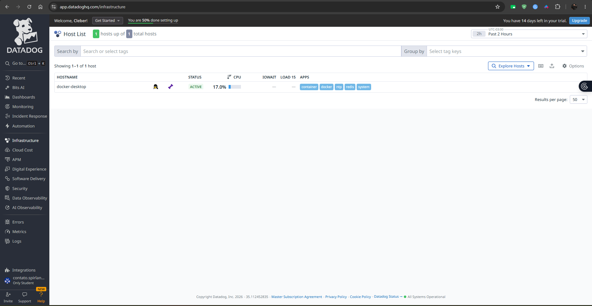
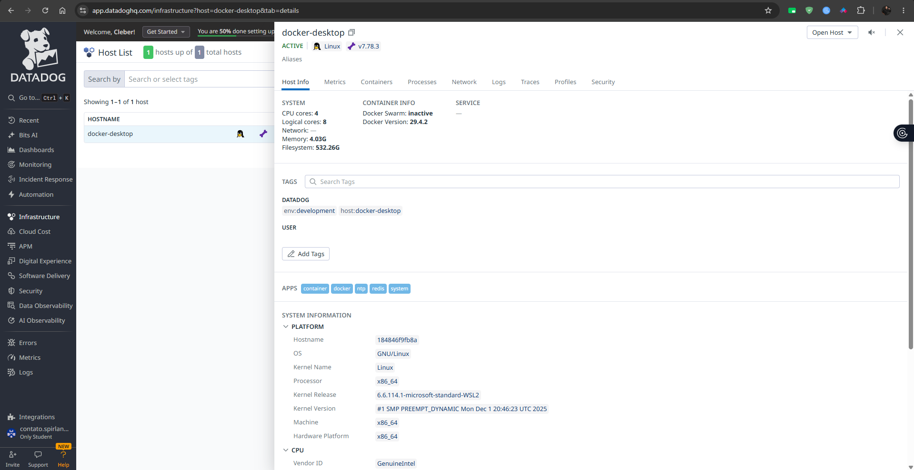
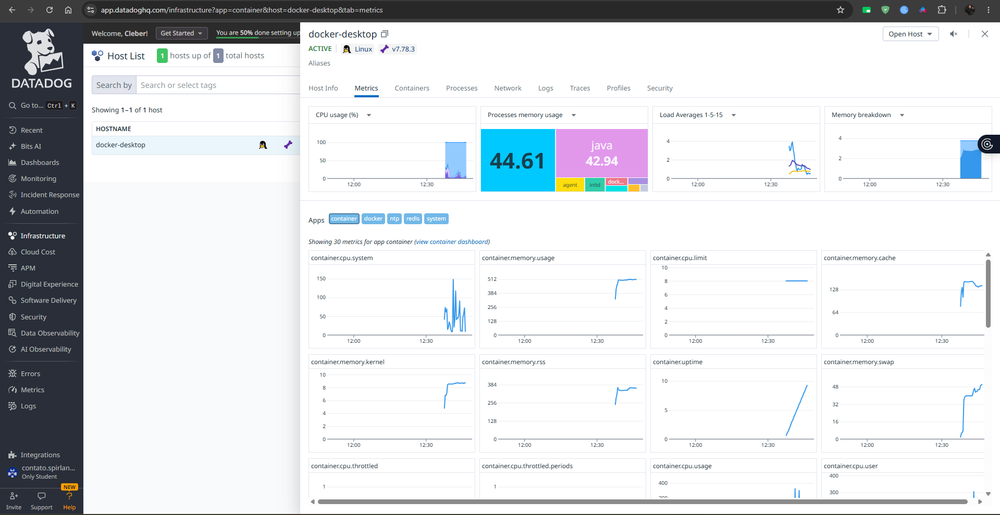

# Datadog Observability - Local Development

Este projeto usa o Datadog Agent via Docker Compose para coletar logs de containers, APM, tracing distribuido, metricas de runtime da API .NET e telemetria dos containers no ambiente local.

## Como configurar

1. Crie ou edite o arquivo `.env` na raiz do repositorio.
2. Substitua o placeholder pela sua API key:

```env
DD_API_KEY=YOUR_DATADOG_API_KEY
```

O arquivo `.env` esta no `.gitignore`. Nao use secrets reais em arquivos versionados.

Valores opcionais:

```env
DD_SITE=datadoghq.com
DD_ENV=development
DD_SERVICE=wex-purchases
DD_VERSION=1.0.0
```

Use `datadoghq.eu`, `us3.datadoghq.com`, `us5.datadoghq.com`, `ap1.datadoghq.com`, `ap2.datadoghq.com` ou outro site Datadog quando sua conta nao estiver no US1.

## Como subir o ambiente

```bash
docker compose up -d --build
```

Servicos principais:

- `wex-purchases-api`: API ASP.NET Core em `http://localhost:8080`
- `wex-mysql`: banco local MySQL
- `wex-redis`: cache local Redis
- `sonarqube`: SonarQube local, quando usado
- `datadog-agent`: Agent local recebendo logs, traces, metricas e dados de containers

Valide a API:

```bash
curl http://localhost:8080/health
```

O resultado esperado e `Healthy`.

## Como a instrumentacao funciona

A API usa `Datadog.Trace.Bundle`, que empacota o profiler nativo junto com a aplicacao. A imagem Docker habilita as variaveis `CORECLR_*` e `DD_DOTNET_TRACER_HOME`, permitindo auto-instrumentation sem instalar tracer no host.

O Compose envia a API para o Agent com:

- `DD_AGENT_HOST=datadog-agent`
- `DD_TRACE_AGENT_PORT=8126`
- `DD_ENV=development`
- `DD_SERVICE=wex-purchases-api`
- `DD_VERSION=1.0.0`

O tracer captura automaticamente requests ASP.NET Core, tempo de resposta, exceptions, chamadas `HttpClient`, chamadas Entity Framework Core e propagacao de contexto distribuido por headers Datadog e W3C Trace Context.

## Logs estruturados

A API escreve logs no console em JSON compacto via Serilog. O Datadog Agent coleta logs de containers com `DD_LOGS_CONFIG_CONTAINER_COLLECT_ALL=true`.

Com `DD_LOGS_INJECTION=true`, o tracer injeta identificadores de correlacao nos logs estruturados, permitindo navegar entre logs e traces no Datadog. Os logs tambem incluem `RequestId`, `TraceId` e `SpanId` quando existe uma atividade HTTP ativa.

## Onde visualizar no Datadog

Infraestrutura:

- Acesse **Infrastructure > Host List**.
- Filtre por `env:development` ou pelos containers `wex-purchases-*`.
- A lista de hosts deve mostrar o host Docker ativo:



- Ao abrir o host `docker-desktop`, valide tags, apps detectados e informacoes do ambiente:



Logs:

- Acesse **Logs > Explorer**.
- Use consultas como:

```text
service:wex-purchases-api env:development
```

Traces:

- Acesse **APM > Traces** ou **APM > Services**.
- Filtre por:

```text
service:wex-purchases-api env:development
```

Metricas:

- Acesse **Metrics > Explorer**.
- Procure por metricas de runtime .NET, APM e containers.
- Exemplos uteis incluem latencia de requests, taxa de erros, throughput e metricas de CPU/memoria do container.
- Tambem e possivel validar metricas direto em **Infrastructure > Host List > docker-desktop > Metrics**:



## Como gerar dados para validacao

Depois de subir o ambiente, execute requests contra a API:

```bash
curl http://localhost:8080/health
curl http://localhost:8080/swagger
```

Para traces mais ricos, exercite endpoints de compras que usem MySQL, Redis e a integracao HTTP externa. As chamadas de banco, cache e HTTP aparecem ligadas ao trace da requisicao quando executadas dentro do fluxo da API.

## Debug de problemas

Verifique se o Agent iniciou:

```bash
docker compose ps datadog-agent
docker compose logs datadog-agent
```

Confirme que a API enxerga o Agent pela rede do Compose:

```bash
docker compose exec wex-purchases-api printenv DD_AGENT_HOST
docker compose exec wex-purchases-api printenv DD_TRACE_AGENT_PORT
```

Se traces nao aparecerem:

- Confirme se `DD_API_KEY` esta correto no `.env`.
- Confirme se `DD_SITE` corresponde ao site da sua organizacao Datadog.
- Gere trafego real depois que os containers estiverem prontos.
- Confira logs do Agent procurando erros de intake, API key ou conectividade.
- Confira se a imagem foi reconstruida com `docker compose up -d --build`.

Se logs nao aparecerem:

- Confirme `DD_LOGS_ENABLED=true`.
- Confirme `DD_LOGS_CONFIG_CONTAINER_COLLECT_ALL=true`.
- Verifique se o container escreve logs no stdout/stderr com `docker compose logs wex-purchases-api`.

## Referencias

- Datadog Docker Compose: https://docs.datadoghq.com/containers/guide/compose-and-the-datadog-agent/
- Datadog Docker APM: https://docs.datadoghq.com/containers/docker/apm/
- Datadog .NET Tracing: https://docs.datadoghq.com/tracing/trace_collection/dd_libraries/dotnet-core/
- Correlacao de logs .NET: https://docs.datadoghq.com/tracing/other_telemetry/connect_logs_and_traces/dotnet/?tab=serilog
