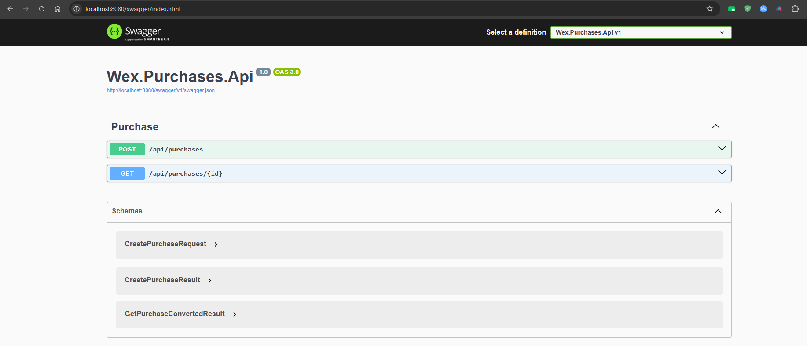

# Local Development

This guide explains how to run the Wex Purchases API locally for development, debugging, and test execution.

## Prerequisites

| Tool | Purpose |
| --- | --- |
| .NET 10 SDK | Builds and runs the API and test projects. |
| Docker Desktop | Runs MySQL, Redis, and the containerized API through Docker Compose. |
| Git | Clones and manages the repository. |
| IDE or editor | Visual Studio, Rider, or VS Code are all suitable. |

## Recommended Local Workflow

The recommended workflow is Docker Compose because it starts the API and all required dependencies without manually installing databases.

```bash
docker compose up --build
```

Then verify the API:

```bash
curl http://localhost:8080/health
```

Swagger UI is available in development:

```text
http://localhost:8080/swagger
```



## Running the API From Source

Use this path when you want a tighter edit-debug loop in the IDE.

1. Start MySQL and Redis. The simplest option is to use Docker Compose and run only the dependencies:

```bash
docker compose up wex-mysql wex-redis
```

2. Restore dependencies:

```bash
dotnet restore src/Wex.Purchases.slnx
```

3. Build the solution:

```bash
dotnet build src/Wex.Purchases.slnx
```

4. Run the API:

```bash
dotnet run --project src/Wex.Purchases.Api/Wex.Purchases.Api.csproj
```

The default local configuration expects:

| Dependency | Connection |
| --- | --- |
| MySQL | `server=localhost;port=3306;database=wex_purchases;user=wex;password=wex123` |
| Redis | `localhost:6379` |

## Database Migrations

The API applies EF Core migrations automatically during startup unless the environment is `Testing`.

This behavior keeps local and containerized development simple:

- Developers do not need to run migration commands manually for the common path.
- Docker Compose can start a clean MySQL volume and let the API create the schema.
- Integration tests can replace persistence with an in-memory provider without executing production migrations.

## Useful Commands

| Command | Purpose |
| --- | --- |
| `dotnet restore src/Wex.Purchases.slnx` | Restores NuGet packages. |
| `dotnet build src/Wex.Purchases.slnx` | Builds the application projects. |
| `dotnet test tests/Wex.Purchases.UnitTests/Wex.Purchases.UnitTests.csproj` | Runs unit tests. |
| `dotnet test tests/Wex.Purchases.IntegrationTests/Wex.Purchases.IntegrationTests.csproj` | Runs integration tests. |
| `docker compose up --build` | Runs API, MySQL, and Redis. |
| `docker compose down` | Stops local containers. |
| `docker compose down -v` | Stops containers and removes the MySQL volume. |

## Local API Smoke Test

Create a purchase:

```bash
curl -X POST http://localhost:8080/api/purchases \
  -H "Content-Type: application/json" \
  -d "{\"description\":\"Office supplies\",\"transactionDate\":\"2026-05-10T00:00:00Z\",\"purchaseAmount\":125.50}"
```

Retrieve a converted purchase:

```bash
curl "http://localhost:8080/api/purchases/{purchase-id}?countryCode=BR"
```

Supported country codes are `BR`, `CA`, and `MX`.

## Troubleshooting

| Symptom | Likely Cause | Resolution |
| --- | --- | --- |
| API cannot connect to MySQL | MySQL container is not ready or port `3306` is in use | Check `docker compose ps` and stop conflicting local MySQL services. |
| API cannot connect to Redis | Redis container is not running or port `6379` is in use | Start `wex-redis` or change the Redis connection string. |
| Treasury conversion fails | No exchange rate exists for the requested currency within six months of the purchase date | Use a supported country code and a purchase date with Treasury data. |
| Swagger is unavailable | API is not running in Development environment | Set `ASPNETCORE_ENVIRONMENT=Development`. |

## Related Documentation

- [Environment Variables](environment-variables.md)
- [Docker Compose](docker-compose.md)
- [Testing Strategy](../testing/testing-strategy.md)
- [Application Flow](../architecture/application-flow.md)
